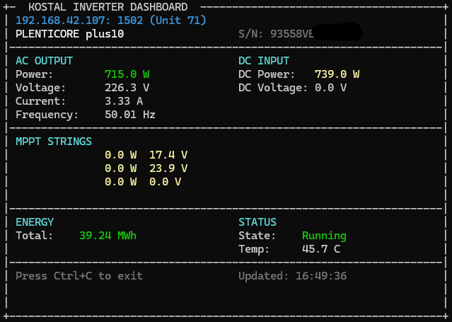
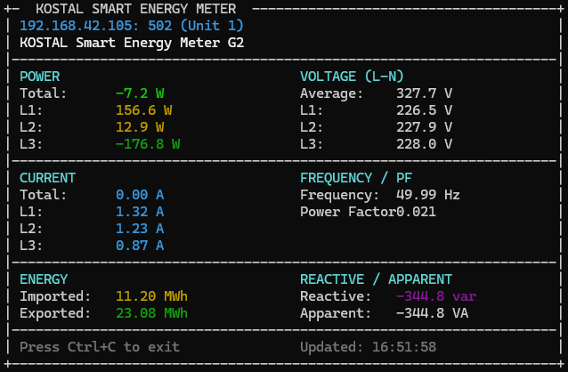

<p align="center">
  
</p>


# AdaModbus

[](https://github.com/flottokarotto/AdaModbus/actions/workflows/ci.yml)
[](https://codecov.io/gh/flottokarotto/AdaModbus)
[](https://www.adacore.com/about-spark)

Ada 2022 Modbus library for embedded and desktop systems.

## Features

- **Protocols**: Modbus RTU, ASCII, and TCP
- **Roles**: Master (Client) and Slave (Server)
- **ZFP-compatible core**: No tasking, exceptions, or dynamic allocation in protocol layer
- **SPARK verified**: Protocol core formally proven (see below)
- **Energy management**: SunSpec, SG-Ready, and §14a grid control support
- **Cross-platform**: Works on Windows, Linux, and embedded systems
- **Transport abstraction**: Generic design allows custom transport backends

## Who is this for?

- **Embedded developers** building industrial devices, PLCs, or IoT gateways that need reliable Modbus communication with minimal runtime overhead
- **Energy system integrators** connecting solar inverters, battery storage, and smart meters using SunSpec profiles
- **Industrial automation engineers** who need a formally verified protocol stack for safety-critical applications
- **Ada/SPARK enthusiasts** looking for a modern, well-documented Modbus implementation
- **C/C++ developers** who want a formally verified Modbus library without writing Ada code (via C API)

## Project Status

> **Note**: This library is functional but has limited real-world testing.

| Component | Maturity | Notes |
|-----------|----------|-------|
| **Modbus TCP** | Well tested | Used with Kostal inverters, KSEM meters, go-e chargers |
| **Protocol Core** | Well tested | 114 unit tests, SPARK proven, loopback verified |
| **SunSpec** | Moderately tested | Tested with Kostal devices |
| **Modbus RTU** | Limited testing | Unit tests pass, needs more hardware validation |
| **Modbus ASCII** | Limited testing | Unit tests pass, not tested with real hardware |
| **Embedded (ARM)** | Experimental | Compiles and runs in QEMU, not deployed on real hardware |
| **Serial Transport** | Limited testing | Basic functionality verified on Windows |
| **TLS Transport** | Experimental | Compiles, not tested with real Modbus/TCP Security devices |

Contributions and real-world testing feedback are welcome!

## Supported Function Codes

| Code | Function                     | Master | Slave |
| ---- | ---------------------------- | ------ | ----- |
| 01   | Read Coils                   | ✓     | ✓    |
| 02   | Read Discrete Inputs         | ✓     | ✓    |
| 03   | Read Holding Registers       | ✓     | ✓    |
| 04   | Read Input Registers         | ✓     | ✓    |
| 05   | Write Single Coil            | ✓     | ✓    |
| 06   | Write Single Register        | ✓     | ✓    |
| 07   | Read Exception Status        | ✓     | ✓    |
| 08   | Diagnostics                  | ✓     | ✓    |
| 15   | Write Multiple Coils         | ✓     | ✓    |
| 16   | Write Multiple Registers     | ✓     | ✓    |
| 17   | Report Server ID             | ✓     | ✓    |
| 22   | Mask Write Register          | ✓     | ✓    |
| 23   | Read/Write Multiple Registers| ✓     | ✓    |

## Building

Requires [Alire](https://alire.ada.dev/) (Ada package manager).

```bash
# Build library
alr build

# Build and run tests (AUnit as submodule)
alr exec -- gprbuild -P tests/aunit_tests.gpr -aP aunit/lib/gnat
./bin/test_runner

# Build examples
alr exec -- gprbuild -P examples/examples.gpr
```

### Without Alire

If you have GPRbuild and GNAT installed:

```bash
gprbuild -P adamodbus.gpr
```

## Testing

See [TESTING.md](TESTING.md) for test coverage documentation.

## Formal Verification (SPARK)

The protocol core and energy packages are formally verified using [SPARK](https://www.adacore.com/about-spark), a subset of Ada designed for high-assurance software.

### What is verified?

| Layer | SPARK | Runtime Checks (Release) |
|-------|-------|--------------------------|
| Protocol (PDU, RTU, ASCII, TCP) | Yes | Disabled (`-gnatp`) |
| Energy (SunSpec, SG-Ready, Grid) | Yes | Disabled (`-gnatp`) |
| Utilities (CRC16, LRC) | Yes | Disabled (`-gnatp`) |
| Master, Slave, Transport, C-API | No | **Enabled** |

### Verification Results

| Metric | Value |
|--------|-------|
| Total checks | 1045 |
| Flow analysis | 263 (25%) |
| Proven (Prover) | 776 (74%) |
| Justified | 6 (1%) |
| Unproven | 0 (0%) |

All runtime checks in SPARK packages are formally proven, enabling safe compilation with `-gnatp`. Non-SPARK packages retain runtime checks.

### Verified Properties

- **No buffer overflows**: All array accesses proven within bounds
- **No integer overflows**: Arithmetic operations proven safe
- **No uninitialized variables**: All data paths verified
- **Correct data flow**: No unexpected aliasing or side effects

### Verified Packages

All protocol and energy packages have `SPARK_Mode => On`:

- `Ada_Modbus` - Base types
- `Ada_Modbus.Protocol` - PDU encoding/decoding
- `Ada_Modbus.Protocol.RTU/ASCII/TCP` - Framing layers
- `Ada_Modbus.CRC16`, `Ada_Modbus.LRC` - Checksums
- `Ada_Modbus.Utilities` - Byte order conversion
- `Ada_Modbus.Slave_Generic`, `Ada_Modbus.Slave_Stubs` - Generic slave handlers
- `Ada_Modbus.Energy.SunSpec` - SunSpec model discovery and utilities
- `Ada_Modbus.Energy.SunSpec.*` - SunSpec device models (Common, Inverter, Storage, Meter, Nameplate, Settings, DER, Battery)
- `Ada_Modbus.Energy.SG_Ready` - Heat pump control
- `Ada_Modbus.Energy.Grid_Control` - §14a power limitation

### Running SPARK Analysis

```bash
# Add gnatprove dependency
alr with gnatprove

# Run proof analysis
alr exec -- gnatprove -P adamodbus.gpr --mode=prove --level=1
```

## Usage

### Master (Client) Example

```ada
with Interfaces; use Interfaces;
with Ada_Modbus; use Ada_Modbus;
with Ada_Modbus.Master;
with Ada_Modbus.Transport.TCP; use Ada_Modbus.Transport.TCP;

procedure Example is
   Connection : aliased TCP_Connection;

   --  Transport callbacks with context
   function Send (Ctx : in out TCP_Connection; Data : Byte_Array) return Natural is
   begin
      return Ada_Modbus.Transport.TCP.Send (Ctx, Data);
   end Send;

   function Receive
     (Ctx : in out TCP_Connection; Buffer : out Byte_Array;
      Max : Natural; Timeout : Natural) return Natural is
   begin
      return Ada_Modbus.Transport.TCP.Receive (Ctx, Buffer, Max, Timeout);
   end Receive;

   function Get_Tick return Unsigned_32 is (0);  --  Simplified for example

   --  Instantiate master with TCP_Connection as transport context
   package My_Master is new Ada_Modbus.Master
     (Transport_Context => TCP_Connection,
      Send              => Send,
      Receive           => Receive,
      Get_Tick_Ms       => Get_Tick);

   Ctx    : My_Master.Master_Context;
   Values : Register_Array (0 .. 9);
   Result : Status;
begin
   --  Connect to Modbus TCP server
   Connect (Connection, "192.168.1.100", 502, 5.0, Result);
   if Result /= Success then
      return;
   end if;

   --  Initialize master with connection
   My_Master.Initialize
     (Ctx,
      (Mode => My_Master.TCP, Default_Slave => 1, Default_Timeout => 1000),
      Connection);

   --  Read 10 holding registers from address 0
   Result := My_Master.Read_Holding_Registers
     (Ctx, Slave => 1, Start_Address => 0, Quantity => 10, Values => Values);

   if Result = Success then
      --  Process values...
      null;
   end if;

   Disconnect (Connection);
end Example;
```

### Slave (Server) Example

```ada
with Ada_Modbus; use Ada_Modbus;
with Ada_Modbus.Slave; use Ada_Modbus.Slave;

procedure Example is
   Registers : Register_Array (0 .. 99) := [others => 0];

   function Read_Holding_Registers
     (Start : Register_Address; Qty : Register_Count; Values : out Register_Array) return Status
   is
   begin
      for I in 0 .. Natural (Qty) - 1 loop
         Values (Values'First + I) := Registers (Natural (Start) + I);
      end loop;
      return Success;
   end Read_Holding_Registers;

   Config : constant Slave_Config :=
     (Mode      => TCP,
      Unit_Id   => 1,
      Callbacks => (Read_Holding_Registers => Read_Holding_Registers'Unrestricted_Access,
                    others => null));

   Request  : Byte_Array (0 .. 259);
   Response : Byte_Array (0 .. 259);
   Req_Len, Resp_Len : Natural;
   Send_Resp : Boolean;
begin
   --  When request is received:
   Process_Request (Config, Request, Req_Len, Response, Resp_Len, Send_Resp);
   --  Send Response (0 .. Resp_Len - 1) if Send_Resp is True
end Example;
```

### Async Master (Non-blocking)

For event-loop or polling-based applications:

```ada
with Ada_Modbus.Master.Async;

--  Instantiate async extension
package My_Async is new My_Master.Async (Max_Pending_Requests => 4);

--  Callback for register reads
procedure On_Response
  (Handle      : My_Async.Request_Handle;
   Resp_Status : My_Async.Response_Status;
   Slave       : Unit_Id;
   Values      : Register_Array;
   Exc_Code    : Byte)
is
begin
   if Resp_Status = My_Async.Response_Success then
      --  Process received values
      null;
   end if;
end On_Response;

Async_Ctx : My_Async.Async_Context;
Handle    : My_Async.Request_Handle;
Success   : Boolean;
begin
   My_Async.Initialize (Async_Ctx, Master_Ctx);

   --  Start async request (returns immediately)
   Success := My_Async.Read_Holding_Registers_Async
     (Async_Ctx, Slave => 1, Start_Address => 0, Quantity => 10,
      On_Response => On_Response'Access, Handle => Handle);

   --  Main loop
   loop
      My_Async.Process_Pending (Async_Ctx);  --  Polls for responses
      --  ... other work ...
   end loop;
end;
```

## Demo Programs

### Basic Examples

```bash
./bin/tcp_slave [port]          # Server (default: 1502)
./bin/tcp_master [host] [port]  # Client (default: localhost 1502)
./bin/rtu_master [port]         # RTU master (serial)
./bin/rtu_slave [port]          # RTU slave (serial)
```

### Energy Monitoring (SunSpec)

```bash
# Kostal inverter (PLENTICORE, PIKO)
./bin/kostal_reader <ip> [port] [unit]     # One-shot reading
./bin/kostal_dashboard <ip> [port] [unit]  # Live terminal dashboard

# Kostal Smart Energy Meter (KSEM)
./bin/ksem_reader <ip> [port] [unit]       # One-shot reading
./bin/ksem_dashboard <ip> [port] [unit]    # Live terminal dashboard
```

<table>
  <tr>
    <td></td>
    <td></td>
  </tr>
  <tr>
    <td align="center"><em>Kostal Inverter Dashboard</em></td>
    <td align="center"><em>KSEM Energy Meter Dashboard</em></td>
  </tr>
</table>

### C Examples

```bash
./bin/c_tcp_slave [port]
./bin/c_tcp_master [host] [port]
```

Build C examples:

```bash
cd examples/c && alr exec -- make
```

## C API

For C developers who want to use the library without writing Ada code.

### Build

```bash
# Desktop
alr build

# Cross-compile for ARM Cortex-M
alr toolchain --select gnat_arm_elf
alr build -- --target=arm-eabi --RTS=light-cortex-m4f -XADAMODBUS_BUILD_MODE=release
```

### Files

Copy these to your project:

| File                          | Description                  |
| ----------------------------- | ---------------------------- |
| `lib/libadamodbus.a`          | Static library               |
| `src/c_api/ada_modbus.h`      | Base C header (TCP master/slave) |
| `src/c_api/ada_modbus_sunspec.h` | SunSpec high-level API |
| `src/c_api/ada_modbus_serial.h`  | Serial/RTU API |

With **Light runtime**: No additional dependencies.
With **Light-Tasking/Full**: Also link `-lgnat`.

### Link

```bash
# Desktop (Windows)
gcc myapp.c -Llib -ladamodbus -lgnat -lws2_32 -o myapp.exe

# Desktop (Linux)
gcc myapp.c -Llib -ladamodbus -lgnat -lpthread -o myapp

# Embedded (Light runtime)
arm-none-eabi-gcc myapp.c -Llib -ladamodbus -o firmware.elf
```

### Base API

See `src/c_api/ada_modbus.h` for full API documentation.
See `examples/c/c_tcp_master.c` and `examples/c/c_tcp_slave.c` for usage examples.

### SunSpec API

High-level functions for SunSpec-compatible devices (inverters, meters, batteries):

```c
#include "ada_modbus.h"
#include "ada_modbus_sunspec.h"

void* master = modbus_master_create();
modbus_master_connect(master, "192.168.1.100", 502, 5000);

// Check for SunSpec support
if (sunspec_check(master, 1, 40000) == MODBUS_SUCCESS) {
    // Find inverter model (101-103)
    sunspec_model_header_t header;
    if (sunspec_find_model(master, 1, 40002, SUNSPEC_MODEL_INVERTER_3P, &header) == MODBUS_SUCCESS) {
        sunspec_inverter_t inv;
        sunspec_read_inverter(master, 1, header.address, &inv);
        printf("AC Power: %.1f W\n", inv.ac_power_w);
        printf("DC Voltage: %.1f V\n", inv.dc_voltage_v);
    }

    // Read meter data
    if (sunspec_find_model(master, 1, 40002, SUNSPEC_MODEL_METER_3P_WYE, &header) == MODBUS_SUCCESS) {
        sunspec_meter_t meter;
        sunspec_read_meter(master, 1, header.address, &meter);
        printf("Total Power: %.1f W\n", meter.total_power_w);
    }
}
```

### Serial/RTU API

For Modbus RTU over RS-232/RS-485:

```c
#include "ada_modbus_serial.h"

// Open serial port
void* serial = modbus_serial_create();
modbus_serial_open(serial, "COM3", 9600, 8, MODBUS_PARITY_NONE, MODBUS_STOP_1);

// Create RTU master
void* rtu = modbus_rtu_master_create(serial, 1, 1000);

// Read registers
uint16_t values[10];
int result = modbus_rtu_read_holding_registers(rtu, 1, 0, 10, values, 1000);
if (result == MODBUS_SUCCESS) {
    for (int i = 0; i < 10; i++) {
        printf("Register %d: %u\n", i, values[i]);
    }
}

// Cleanup
modbus_rtu_master_destroy(rtu);
modbus_serial_close(serial);
modbus_serial_destroy(serial);
```

## Package Structure

```
Ada_Modbus                         -- Base types (Byte, Register, Status, etc.)
├── Ada_Modbus.Utilities           -- Byte order conversion
├── Ada_Modbus.CRC16               -- CRC-16 for RTU
├── Ada_Modbus.LRC                 -- LRC for ASCII
├── Ada_Modbus.Protocol            -- PDU encoding/decoding
│   ├── Ada_Modbus.Protocol.RTU    -- RTU framing
│   ├── Ada_Modbus.Protocol.ASCII  -- ASCII framing
│   └── Ada_Modbus.Protocol.TCP    -- MBAP/TCP framing
├── Ada_Modbus.Master              -- Master (Client) - generic
│   └── Ada_Modbus.Master.Async    -- Non-blocking async API
├── Ada_Modbus.Slave               -- Slave (Server) - callback-based
├── Ada_Modbus.Transport           -- Transport abstraction
│   ├── Ada_Modbus.Transport.TCP   -- TCP socket backend
│   └── Ada_Modbus.Transport.Serial -- Serial port (COM/TTY) backend
├── Ada_Modbus.C_API               -- C bindings
│   ├── Ada_Modbus.C_API.SunSpec   -- SunSpec high-level C API
│   └── Ada_Modbus.C_API.Serial    -- Serial/RTU C API
└── Ada_Modbus.Energy              -- Energy management extensions
    ├── Ada_Modbus.Energy.SG_Ready    -- Heat pump control (generic)
    ├── Ada_Modbus.Energy.Grid_Control -- §14a power limitation (generic)
    └── Ada_Modbus.Energy.SunSpec     -- SunSpec Alliance profiles
        ├── Ada_Modbus.Energy.SunSpec.Common   -- Model 1: Device info
        ├── Ada_Modbus.Energy.SunSpec.Inverter -- Models 101-103, 160: Inverter + MPPT
        ├── Ada_Modbus.Energy.SunSpec.Storage  -- Model 124: Battery storage
        ├── Ada_Modbus.Energy.SunSpec.Meter    -- Models 201-204: Energy meters
        ├── Ada_Modbus.Energy.SunSpec.Nameplate -- Model 120: Inverter ratings
        ├── Ada_Modbus.Energy.SunSpec.Settings -- Model 121: Basic settings
        ├── Ada_Modbus.Energy.SunSpec.DER      -- Models 701/704: Grid integration
        └── Ada_Modbus.Energy.SunSpec.Battery  -- Model 802: Extended battery
```

## Directory Structure

```
AdaModbus/
├── src/
│   ├── core/           -- Protocol + Master/Slave (mixed SPARK/Non-SPARK)
│   ├── transport/      -- Transport backends (Non-SPARK)
│   ├── energy/         -- Energy management (SPARK-verified)
│   └── c_api/          -- C interface (Non-SPARK)
├── tls/                -- TLS extension (separate Alire crate)
├── tests/
│   └── unit/           -- AUnit tests
├── examples/           -- Demo programs
├── adamodbus.gpr       -- Main GPR project
├── alire.toml          -- Alire manifest
└── README.md
```

## License

[MIT](LICENSE)

## Disclaimer

THE SOFTWARE IS PROVIDED "AS IS", WITHOUT WARRANTY OF ANY KIND, EXPRESS OR
IMPLIED, INCLUDING BUT NOT LIMITED TO THE WARRANTIES OF MERCHANTABILITY,
FITNESS FOR A PARTICULAR PURPOSE AND NONINFRINGEMENT. IN NO EVENT SHALL THE
AUTHORS BE LIABLE FOR ANY CLAIM, DAMAGES OR OTHER LIABILITY, WHETHER IN AN
ACTION OF CONTRACT, TORT OR OTHERWISE, ARISING FROM, OUT OF OR IN CONNECTION
WITH THE SOFTWARE OR THE USE OR OTHER DEALINGS IN THE SOFTWARE.
